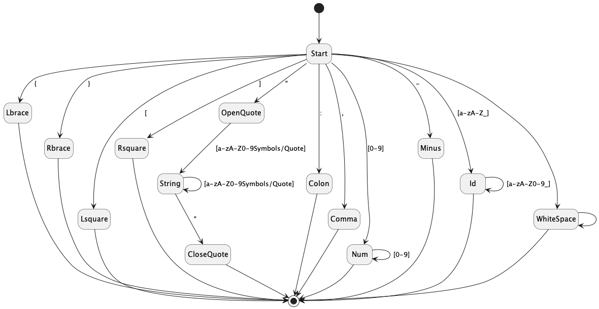

# JSON Parser

## Deterministic Finite Automata



## Context Free Grammar
```math
\begin{align}
\text{S} &\rightarrow  \ \vdash object \dashv \\
\text{object} &\rightarrow \text{LBRACE statements RBRACE} \\
\text{statements} &\rightarrow \epsilon \\
\text{statements} &\rightarrow \text{statement nextStatements}\\
\text{nextStatements} &\rightarrow \epsilon \\
\text{nextStatements} &\rightarrow \text{COMMA statements} \\
\text{statement} &\rightarrow \text{STRING COLON value} \\
\text{value} &\rightarrow \text{object} \\
\text{value} &\rightarrow \text{array} \\
\text{value} &\rightarrow \text{keywords} \\
\text{value} &\rightarrow \text{STRING} \\
\text{value} &\rightarrow \text{NUM} \\
\text{keywords} &\rightarrow \text{NULL} \\
\text{keywords} &\rightarrow \text{FALSE} \\
\text{keywords} &\rightarrow \text{TRUE} \\
\text{array} &\rightarrow \text{LSQUARE items RSQUARE} \\
\text{items} &\rightarrow \epsilon \\
\text{items} &\rightarrow \text{item nextItems} \\
\text{nextItems} &\rightarrow \epsilon \\
\text{nextItems} &\rightarrow \text{COMMA items} \\
\text{item} &\rightarrow \text{value} \\
\end{align}
```

## Lessons Learnt
From the lessosn learnt, let's try to readjust the rules to do left factoring such that there are no two unique rules that generate the same first terminal. But the issue with this is there could be trailing commas, `end` if it sees that the input is a Comma, it will gladly parse it, not knowing that it could be the end

**Rules**

```math
\begin{align}
\text{S} &\rightarrow  \ \vdash object \dashv \\
\text{object} &\rightarrow \text{LBRACE statements RBRACE} \\
\text{statements} &\rightarrow \epsilon \\
\text{statements} &\rightarrow \text{statement statements}\\
\text{statement} &\rightarrow \text{STRING COLON value end} \\
\text{end} &\rightarrow \epsilon \\
\text{end} &\rightarrow \text{COMMA} \\
\text{value} &\rightarrow \text{object} \\
\text{value} &\rightarrow \text{array} \\
\text{value} &\rightarrow \text{keywords} \\
\text{value} &\rightarrow \text{STRING} \\
\text{value} &\rightarrow \text{NUM} \\
\text{keywords} &\rightarrow \text{NULL} \\
\text{keywords} &\rightarrow \text{FALSE} \\
\text{keywords} &\rightarrow \text{TRUE} \\
\text{array} &\rightarrow \text{LSQUARE items RSQUARE} \\
\text{items} &\rightarrow \epsilon \\
\text{items} &\rightarrow \text{item items} \\
\text{item} &\rightarrow \text{value end} \\
\end{align}
```


**Nullable**
|Non-Terminals|Nullable|
|---|---|
|S|false|
|object|false|
|statements|true|
|statement|false|
|end|true|
|value|false|
|array|false|
|items|true|
|item|false|
|keywords|false|

**First**
|Non-Terminals|First|
|---|---|
|S|$\vdash$|
|object|$\text{LBRACE}$|
|statements|$\text{STRING}$|
|statement|$\text{STRING}$|
|end|$\text{COMMA}$|
|value|$\text{LBRACE, LSQUARE, NULL, FALSE, TRUE, STRING, NUM}$|
|array|$\text{LSQUARE}$|
|items|$\text{LBRACE, LSQUARE, NULL, FALSE, TRUE, STRING, NUM}$|
|item|$\text{LBRACE, LSQUARE, NULL, FALSE, TRUE, STRING, NUM}$|
|keywords|$\text{NULL, FALSE, TRUE}$|

**Follow**
|Non-Terminals|Follow|
|---|---|
|object|$\dashv, \text{COMMA, RBRACE, RSQUARE}$|
|statements|$\text{RBRACE}$|
|statement|$\text{RBRACE, STRING}$|
|end|$\text{RBRACE, RSQUARE, STRING}$|
|value|$\text{RBRACE, RSQUARE, COMMA}$|
|array|$\text{RBRACE, RSQUARE, COMMA}$|
|items|$\text{RSQAURE}$|
|item|$\text{LBRACE, LSQUARE, STRING, NUM, NULL, FALSE, TRUE}$|
|keywords|$\text{RBRACE, RSQUARE, COMMA}$|

**Predict Table**
||$\vdash$|$\dashv$|{|}|[|]|STRING|COLON|COMMA|NUM|NULL|FALSE|TRUE
|---|---|---|---|---|---|---|---|--|--|--|--|--|--|
|S|1|||||||||||||
|object|||2|||||||||||
|statements||||3|||4|||||||
|statement|||||||5|||||||
|end||||6||6|6||7||||||||
|value|||8||9||11|||12|10|10|10|
|array|||||16||||||||||
|items|||18||18|17|18|||18|18|18|18|
|item|||19||19||19|||19|19|19|19|
|keywords|||||||||||13|14|15|


These rules form a CFG that is ambiguous. Rule 6 and 7 are two unique rules that generate the same first terminal. Take note that left recursive grammar as shown from rule 4 can never support the LL(1) parsing algorithm. So we must try to force to be right recursive.

**Rules**
```math
\begin{align*}
\text{S} &\rightarrow  \ \vdash object \dashv \\
\text{object} &\rightarrow \text{LBRACE statements RBRACE} \\
\text{statements} &\rightarrow \epsilon \\
\text{statements} &\rightarrow \text{prevStatements endStatement}\\
\text{endStatement} &\rightarrow \text{STRING COLON value} \\
\text{prevStatements} &\rightarrow \epsilon \\
\text{prevStatements} &\rightarrow \text{prevStatements statement} \\
\text{statement} &\rightarrow \text{STRING COLON value COMMA} \\
\text{value} &\rightarrow \text{object | array | keywords | STRING | NUM} \\
\text{array} &\rightarrow \text{LSQUARE items RSQUARE} \\
\text{items} &\rightarrow \epsilon \\
\text{items} &\rightarrow \text{prevItems endItem} \\
\text{endItem} &\rightarrow \text{value} \\
\text{prevItems} &\rightarrow \epsilon \\
\text{prevItems} &\rightarrow \text{prevItems item} \\
\text{item} &\rightarrow \text{value COMMA} \\
\text{keywords} &\rightarrow \text{NULL | FALSE | TRUE} \\
\end{align*}
```

- These rules shouldn't support traililng comma
- There are a compule of rules that start with the same terminal on the RHS, resulting in ambiguous grammar hence top-down parsing is not an option here

**Nullable**
|Iteration|...|2|
|---|---|---|
|S||false|
|object||false|
|statements||true|
|prevStatements||true|
|endStatement||false|
|statement||false|
|value||false|
|array||false|
|items||true|
|prevItems||true|
|endItem||false|
|item||false|
|keywords||false|


**First**
|Iteration|...|2|
|---|---|---|
|S||$\{\vdash\}$|
|object||$\{\text{LBRACE}\}$|
|statements||$\{\text{STRING}\}$|
|prevStatements||$\{\text{STRING}\}$|
|endStatement||$\{\text{STRING}\}$|
|statement||$\{\text{STRING}\}$|
|value||$\{\text{STRING, NUM, LBRACE, LSQUARE, NULL, FALSE, TRUE}\}$|
|array||$\{\text{LSQAURE}\}$|
|items||$\{\text{STRING, NUM, LBRACE, LSQUARE, NULL, FALSE, TRUE}\}$|
|prevItems||$\{\text{STRING, NUM, LBRACE, LSQUARE, NULL, FALSE, TRUE}\}$|
|endItem||$\{\text{STRING, NUM, LBRACE, LSQUARE, NULL, FALSE, TRUE}\}$|
|item||$\{\text{STRING, NUM, LBRACE, LSQUARE, NULL, FALSE, TRUE}\}$|
|keywords||$\{\text{NULL, FALSE, TRUE}\}$|

**Follow**
|Iteration|...|2|
|---|---|---|
|object||$\{\dashv, \text{COMMA, RBRACE, RSQUARE}\}$|
|statements||$\{\text{RBRACE}\}$|
|prevStatements||$\{\text{STRING}\}$|
|endStatement||$\{\text{RBRACE}\}$|
|statement||$\{\text{STRING}\}$|
|value||$\{\text{COMMA, RBRACE, RSQUARE}\}$|
|array||$\{\text{COMMA, RBRACE, RSQUARE}\}$|
|items||$\{\text{RSQUARE}\}$|
|prevItems||$\{\text{STRING, NUM, LBRACE, LSQUARE, NULL, FALSE, TRUE}\}$|
|endItem||$\{\text{RSQUARE}\}$|
|item||$\{\text{STRING, NUM, LBRACE, LSQUARE, NULL, FALSE, TRUE}\}$|
|keywords||$\{\text{COMMA, RBRACE, RSQUARE}\}$|
## Notes
- To be able to parse JSON, we need to be able to read in data from somewhere, this includes from reading a file and from standard output. Both using a buffered reader. 
- We need someone to be able to parse the input, lets call this class `JSONParser` which contains a buffered reader
- A JSON object can be identifed with the curly brackets. Since there could be a recursive nature of JSON object 
- How do we know if the input is valid? Solving the issue of balancing parenthesis!
- How do we determine a key value pair? The use of a colon
- types: string
- Use simplified maxmimal munch algorithm to scan through input and create a list of tokens
- strings only support double quotes, once might get too complicated if i see another double quote
- we could probaby improve debugging to the user by not rejecting the whitespace tokens during the tokeniser phase. We can take these tokens
and count the number of whitespace and lines to keep track of the position of the error
