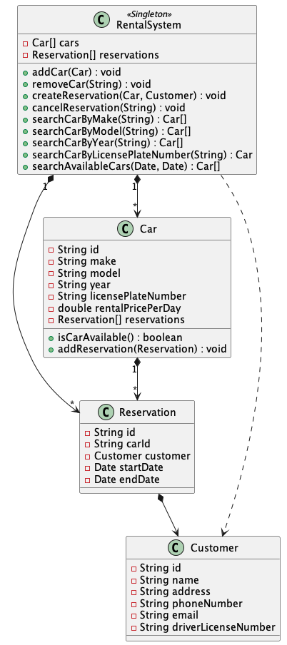

# Designing a Parking Lot System
This project is inspired from [awesome-low-level-design](https://github.com/ashishps1/awesome-low-level-design/blob/main/problems/parking-lot.md)

## Requirements
1. The parking lot should have multiple levels, each level with a certain number of parking spots.
2. The parking lot should support different types of vehicles, such as cars, motorcycles, and trucks.
3. Each parking spot should be able to accommodate a specific type of vehicle.
4. The system should assign a parking spot to a vehicle upon entry and release it when the vehicle exits.
5. The system should track the availability of parking spots and provide real-time information to customers.
6. The system should handle multiple entry and exit points and support concurrent access.
## Class Diagram

## Lessons learnt / improvements
- In `rental_system` to check whether or not a car is available we have to check through all the reservations. However, this responsibility lies on whether or not the car is available. An improvement to this is for the cars to track all its own reservation 
- In `rental_system` when we remove a reservation, we shouldn't need to remove reservation from both the reservation and the car side as this only increases complexity if we add in more classes that compose of reservation. Ideally, deleting a `Reservation`, we should handle the case of the `Car` attached 
- Handle exceptions
- In `rental_system`, for all the search methods, it can abstracted into a search function that takes the field that you're interested in rather than creating different search functions
- Came across a circular depedency between `Car` and `Reservation`
