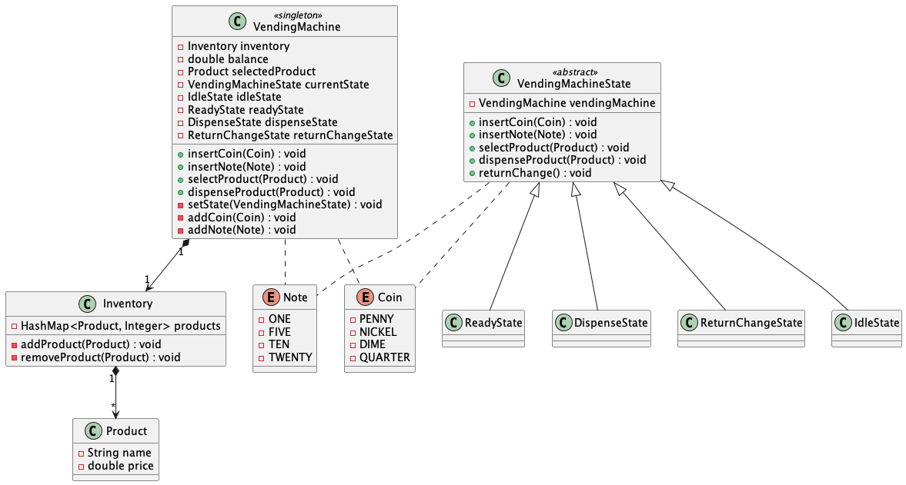
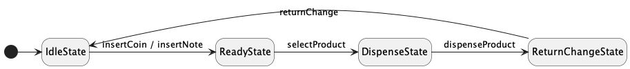

# Designing a Vending Machine

## Requirements
1. The vending machine should support multiple products with different prices and quantities.
2. The machine should accept coins and notes of different denominations.
3. The machine should dispense the selected product and return change if necessary.
4. The machine should keep track of the available products and their quantities.
5. The machine should handle multiple transactions concurrently and ensure data consistency.
6. The machine should provide an interface for restocking products and collecting money.
7. The machine should handle exceptional scenarios, such as insufficient funds or out-of-stock products.

## Diagrams

## Lessons learnt
- Using the State design pattern
